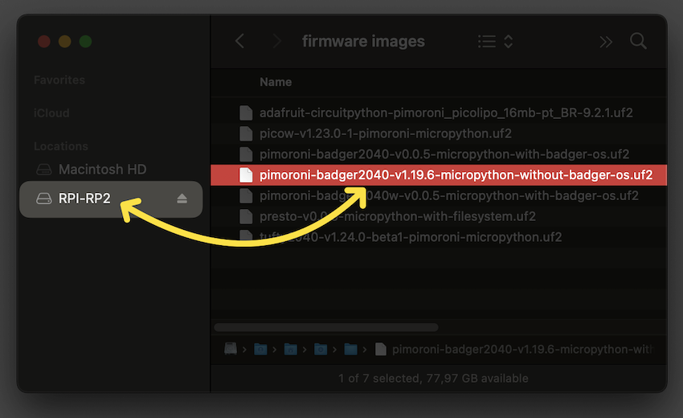
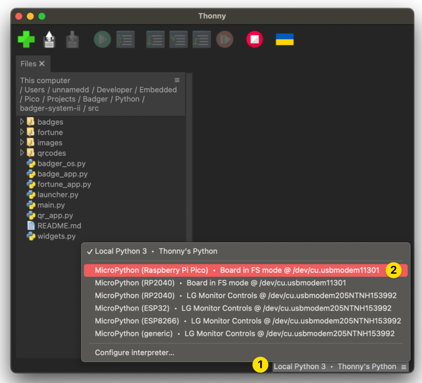
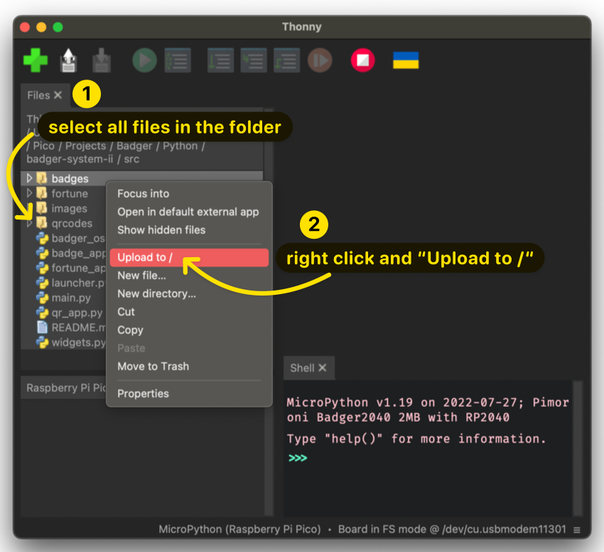
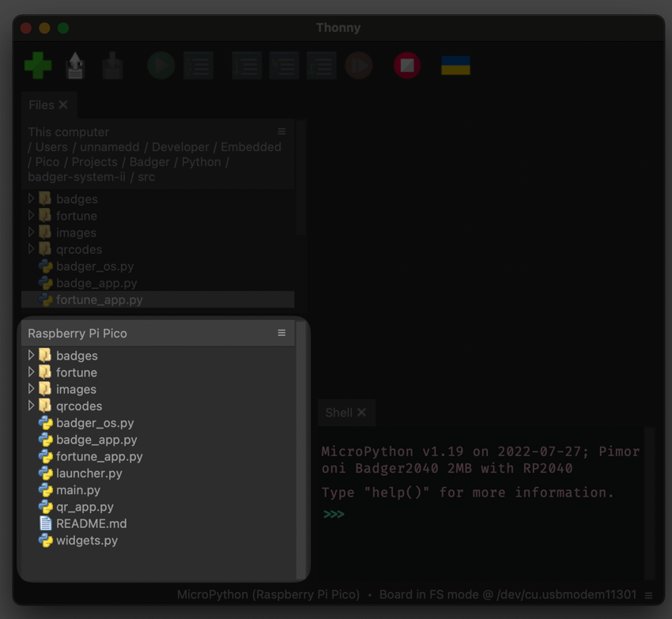

# Badger2040 System II

Tired of boring badges that just blend in with the crowd? You want to show off your quirky personality and love of retro technology? You are looking for a fun project to bond with your engineering team? Look no further than the programmable e-ink badge!

https://kruzenshtern.org/the-e-ink-badge-the-coolest-badge-you-didnt-know-you-needed/

## Source code

Don't expect much, but it works (tm). See in /src.

## How to make it work?

Currently, to make this project work on your Badger2040, it is unfortunately necessary to use an old version of the bootloader provided by Pimoroni (1.19.6). Soon, you will be able to use recent versions. Until then, to make it work, follow the instructions below.

1. Download [`bootloader 1.19.6`](https://github.com/pimoroni/pimoroni-pico/releases/tag/v1.19.6)
2. Initialize Badger2040 in **boot mode** (press the `bootsel` button while connecting the USB-C cable)
3. Move the `pimoroni-badger2040-v1.19.6-micropython-without-badger-os.uf2` file to the `RPI-RP2` mounted drive 
4. Open Thonny (the editor used with MicroPython for Raspberry Pi Pico)
5. Select the correct board, usually `MicroPython (Raspberry Pi Pico)` 
6. Select the menu `View` and then `Files`
   1. If any, select all the files from your Badger2040 and delete them
7. Select all files from this on your computer and right-click
8. Select `Upload to /` 
9. After finishing the upload, you should see all your files under the widget `Raspberry Pi Pico` on the bottom-left widget 
10. To finish, go to the menu `Run` and then `Send EOF / Soft Reboot`

You can edit all the files directly from the board using Thonny; however, after saving, it is common to receive an error from Thonny saying::
`Device is busy -- can't perform this action now. Please wait or cancel current work and try again!`

If this happens, just re-select the board on the board list (bottom-right).

## Components

1. Badger 2040: https://shop.pimoroni.com/products/badger-2040
2. Coin Cell Battery Holder: https://www.adafruit.com/product/783
3. 2x CR2032: https://www.amazon.com/gp/product/B078GC5K81/
4. 4x M2 8mm bolts: https://www.amazon.com/gp/product/B01BNIHG0E/
5. 3D-printed case: see /case folder. I was using Prusament PLA: https://www.prusa3d.com/product/prusament-pla-ms-pink-blend-970g/

## A quick glance at assembly steps

1. 3D print top and bottom panels.
2. Disassemble & attach a 2xCR2032 battery holder
3. Assemble the badge, use hot glue whenever applicable
4. Upload pimonori-badger2040-micropython bootloader
5. Upload Python scripts

## License & acknowledgements

Inspiration sources for the case:

- https://kaenner.de/badger2040 (CC4)
- https://www.thingiverse.com/thing:5320100/files (CC4)

I ended up using an OpenSCAD blueprint by usedbytes to get measurements of the device. Reconstructed/synthesized a new case in Fusion360. Noticeable changes:
- A different battery holder / back pannel to simplify the assembly to some extent
- Two coin cells vs three
- Added hidden buttons inspired by Känner's design
- Back panel is inspired by Känner's design too, I like that connectors are accessible
- Battery toggle button
- Any mistakes are exclusively mine

Source code:
- To a large extent based on pimoroni Badger2040 OS example: https://github.com/pimoroni/pimoroni-pico/tree/main/micropython/examples/badger2040 (MIT)
- Font & rendering: custom code, but it is not worth extracting it to a standalone app/library. Let's stick with MIT for simplicity too.

Assets:
- Font: 16bfZX https://www.pentacom.jp/pentacom/bitfontmaker2/gallery/?id=246 (Public domain)
- Clippy: hand-drawn, I think the character is trademarked by Microsoft though.
- Other assets: hand-drawn

What does it mean in terms of license? I guess, it is good for a hobby project. Hire a lawyer to check if it is good for commercial use.

## From

The folks at [Census](http://getcensus.com) originally put this together. Have data? We'll sync your data warehouse with your CRM and the customer success apps critical to your team.
